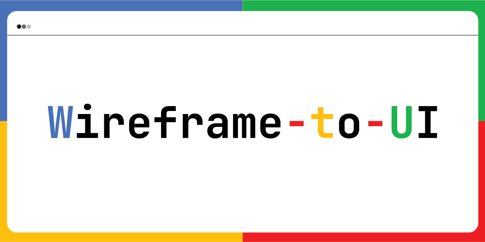
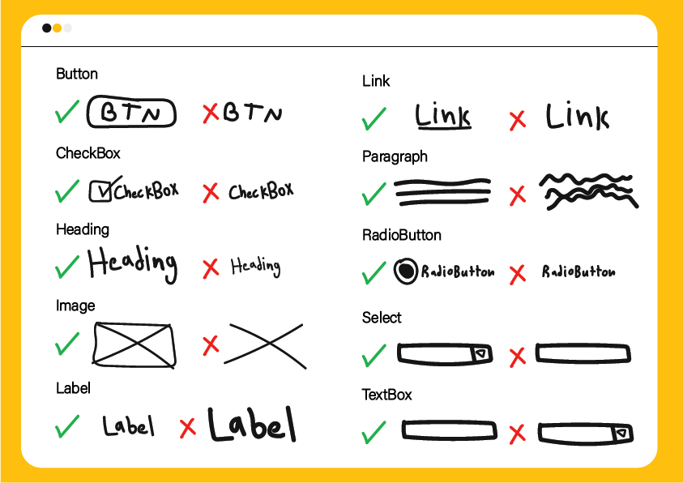

# Wireframe to User Interface Using Deep Learning Approach



This project demo for converting image of drawed wireframe to html code trained with YOLOv5 model.

## Tools

- Python
- Pytorch
- OpenCV
- Streamlit

## Dataset
```
https://github.com/Ala-Alsanea/sketch_web_ui_dataset
```



## Trained model notebook 
```
https://github.com/Ala-Alsanea/YOLO_sketch_web_ui
```

## Demo
https://github.com/Ala-Alsanea/wireframe-to-UI/assets/88606691/d2f2228c-d05c-4766-818f-2040fb1cf10d

